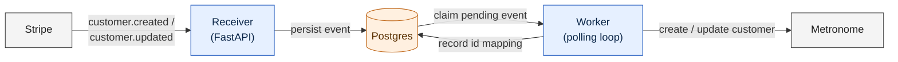
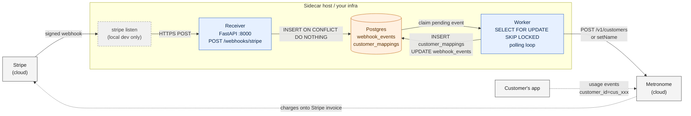
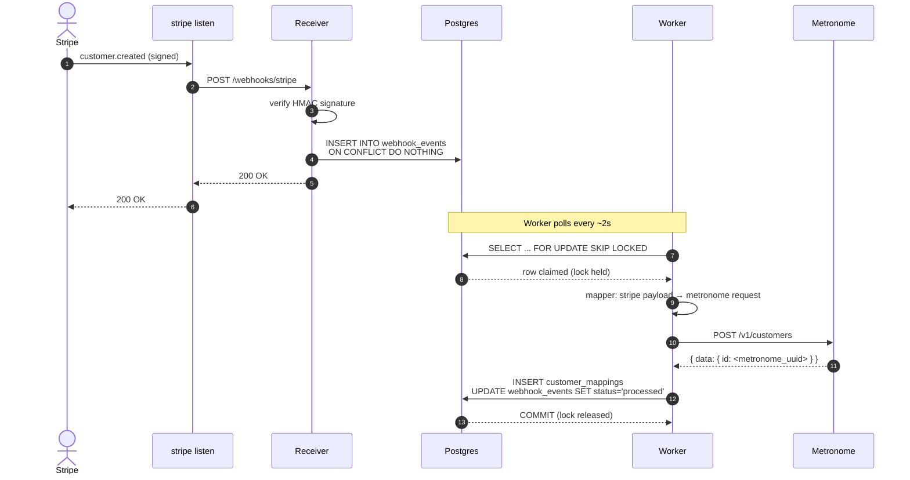

# Architecture

> Three diagrams of the Stripe → Metronome sidecar (v0.1, customer sync only).
> Each is plain Mermaid — render inline on GitHub, edit at [mermaid.live](https://mermaid.live),
> or import into Lucidchart via `File → Import → Mermaid`.

## At a glance

A Stripe webhook lands → we persist it → a worker calls Metronome → we record the ID mapping. That's the whole loop.



The receiver and worker are deliberately split so the receiver can return `200 OK` to Stripe in milliseconds regardless of how slow Metronome is. The worker carries the slow, retry-able work.

## Detailed architecture

The same picture with the extras: the local-dev tunnel, the database tables, and the second data flow this sidecar does **not** handle (usage events going straight to Metronome, and Metronome posting charges back to Stripe invoices).



- **Solid arrows** = handled by this sidecar.
- **Dotted arrows** = configured separately (Metronome ↔ Stripe OAuth integration; customer's app emits usage directly).
- **Dashed `stripe listen` box** = local dev only. In production, Stripe POSTs directly to the receiver's public URL.

## Happy-path runtime (one event)

What actually happens when a single `customer.created` fires.



The receiver-side and worker-side halves are decoupled by the database, so a slow Metronome never slows down webhook ingestion.

## Event lifecycle

Every row in `webhook_events` lives in exactly one of these states. The state machine is the entire retry/failure contract:

```mermaid
stateDiagram-v2
    [*] --> pending: receiver INSERT

    pending --> processed: handler success
    pending --> pending: transient error<br/>(5xx / 429 / network)<br/>attempts++ ; next_attempt_at += backoff
    pending --> failed: permanent error<br/>(4xx / mapper error)
    pending --> failed: attempts >= WORKER_MAX_ATTEMPTS

    processed --> [*]
    failed --> pending: operator replay<br/>(UPDATE SET status='pending', attempts=0)
    failed --> [*]: accepted / triaged
```



- **`pending → processed`**: terminal happy path.
- **`pending → pending`**: transient failure, scheduled retry with exponential backoff + jitter.
- **`pending → failed`**: either a permanent error (no retry will help) or we hit the retry budget.
- **`failed → pending`**: the operator escape hatch. One SQL update puts a row back in the queue:

  ```sql
  UPDATE webhook_events
  SET status='pending', attempts=0, next_attempt_at=NOW(),
      last_error=NULL, processed_at=NULL
  WHERE stripe_event_id = 'evt_...';
  ```

## How it maps to production

| Local dev | Production |
|---|---|
| `uvicorn` in a terminal | Long-running container behind a load balancer with TLS |
| `python -m sidecar.worker` in a terminal | Long-running container, no exposed port; scale to N replicas safely (`SKIP LOCKED`) |
| `stripe listen` tunnel | Gone — replaced by a webhook endpoint registered in Stripe Dashboard → Developers → Webhooks |
| Homebrew Postgres on `:5432` | Managed Postgres (RDS, Cloud SQL, Neon, Supabase, etc.) |
| `alembic upgrade head` in your shell | One-shot job before each release (see the `migrate` service in `docker-compose.yml`) |

Same image, different commands. The Dockerfile in this repo is the production unit; the `docker-compose.yml` shows the topology.
